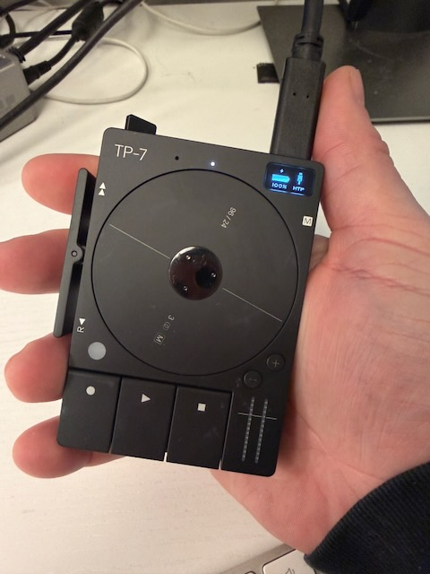

# TP-7 VoiceSync

A macOS menu bar app that automatically syncs, transcribes, and organizes your Teenage Engineering TP-7 voice recordings.

  <table>
    <tr>
      <td align="center">
        
         
        <em>Recordings are automatically transcribed and uploaded to S3</em>
      </td>
      <td align="center">
        
         
        <em>Menu Bar Popover</em>
      </td>
    </tr>
  </table>

  
   
  <em>Transcribed notes are automatically synced to Apple Notes with a summary, a title added, and a download link.</em>

## Table of Contents

- [Features](#features)
- [Why I Built This](#why-i-built-this)
- [About the TP-7 and FieldKit](#about-the-tp-7-and-fieldkit)
- [Requirements](#requirements)
- [Installation](#installation)
- [Setup Guide](#setup-guide)
- [Usage](#usage)
- [Troubleshooting](#troubleshooting)

## Features

- **Automatic Device Detection** — Detects when your TP-7 connects via FieldKit
- **Cloud Backup to S3** — Automatically uploads recordings to AWS S3 with SHA256 deduplication
- **AI Transcription** — Transcribes audio using ElevenLabs Scribe v1 model
- **Smart Titles & Summaries** — Generates meaningful titles using LLM via OpenRouter (optional)
- **Apple Notes Integration** — Creates notes with transcriptions, metadata, and playable audio links
- **Menu Bar Interface** — Quick access to recent recordings and sync status
- **Soft Delete** — Prevents re-syncing of recordings you've deleted

## Why I Built This

I own a [TP-7](https://teenage.engineering/products/tp-7) and I love recording memos with it. While some may say this is a $1,400 toy for nerds masquerading as audiophiles, I find it to be an extremely pleasurable device for taking notes. Sure, I could use the Voice Memo app on my iPhone, which already has great transcription capabilities. I want to keep a device in my pocket that I can easily lose to take voice notes for ideas about side projects that I'll never complete.

The TP-7 is the Ferrari of audio recorders. It has a beautiful feel and a physical rotating recording wheel that makes it feel like a device from an earlier age.

  
   
  <em>The Teenage Engineering TP-7 Field Recorder</em>

I love taking memos with this thing, but I didn't know what to do with these recordings. Teenage Engineering has an absolutely awful iPhone app and Mac app that allows you to interface with the device that is primarily designed for recording music or used with the mixer and field mic that they sell, but I really only use it for voice memos.

After futzing around for a few days, I decided to make a little macOS app that allowed me to plug it in and automatically download the voice memos. 15 hours later, I ended up with a macOS app that transcribes the audio recordings and sends them to your Notes app.

If you have a [TP-7](https://teenage.engineering/products/tp-7) and use it to record memos, then I encourage you to download and take a look.

> [!CAUTION]
> This app is 1000% vibe-coded using Claude Code while I was waiting for builds to pass. It is definitely not reviewed seriously for security concerns or major bugs that could crash your computer. Install with caution.

## About the TP-7 and FieldKit

### The TP-7 Field Recorder

The [Teenage Engineering TP-7](https://teenage.engineering/products/tp-7) is a premium portable audio recorder designed to capture sound, music, interviews, and ideas with zero friction. Key features include:

- **128GB internal storage** — enough to record 5 minutes a day for 20 years
- **24-bit/96kHz audio quality** — professional-grade recording
- **Motorized tape reel** — a beautiful, functional interface element for scrubbing and navigation
- **Built-in microphone and speaker** — record and playback anywhere
- **7-hour battery life** — all-day recording capability
- **Instant memo mode** — press the memo button when the device is off to start recording immediately

- [Teenage Engineering](https://teenage.engineering) — Official website
- [TP-7 Product Page](https://teenage.engineering/products/tp-7) — Full specs and details
- [TP-7 Guide](https://teenage.engineering/guides/tp-7) — Official user guide

### FieldKit

[FieldKit](https://teenage.engineering/guides/fieldkit) is a macOS application by Teenage Engineering that provides MTP (Media Transfer Protocol) support. This is required because macOS doesn't natively support MTP for file transfers.

When you connect your TP-7 via USB and enable MTP mode, FieldKit mounts the device storage as an accessible folder on your Mac. This app monitors that folder for new recordings.

**Get FieldKit:** [Mac App Store](https://apps.apple.com/us/app/field-kit/id1612653346)

## Requirements

- **macOS 14.0 (Sonoma)** or later
- **FieldKit** app from Mac App Store
- **AWS S3 bucket** with access credentials
- **ElevenLabs API key** for transcription
- **OpenRouter API key** (optional) for AI-generated titles and summaries

## Installation

1. Download the latest release from [GitHub Releases](../../releases)
2. Open the DMG file
3. Drag the app to your Applications folder
4. Launch TP-7 VoiceSync from Applications

## Setup Guide

### Step 1: Install FieldKit

1. Install [FieldKit](https://apps.apple.com/us/app/field-kit/id1612653346) from the Mac App Store
2. Connect your TP-7 via USB
3. On the TP-7, enter MTP mode (shift + com, then T4)
4. Verify FieldKit shows your device is connected

### Step 2: Configure AWS S3

You'll need an S3 bucket to store your recordings in the cloud.

1. Create an S3 bucket in the [AWS Console](https://console.aws.amazon.com/s3)
2. Create an IAM user with S3 access (recommended policy: `AmazonS3FullAccess` or a custom policy for your bucket)
3. Generate an Access Key ID and Secret Access Key for the IAM user
4. In TP-7 VoiceSync, go to **Settings > S3**
5. Enter your bucket name, region, and credentials
6. Click "Test Connection" to verify

### Step 3: Set Up ElevenLabs

ElevenLabs provides the AI transcription service.

1. Sign up at [elevenlabs.io](https://elevenlabs.io)
2. Go to your profile and copy your API key
3. In TP-7 VoiceSync, go to **Settings > API Keys**
4. Enter your ElevenLabs API key
5. Click "Validate" to verify

### Step 4: Set Up OpenRouter (Optional)

OpenRouter provides LLM access for generating intelligent titles and summaries.

1. Sign up at [openrouter.ai](https://openrouter.ai)
2. Get your API key from the dashboard
3. In TP-7 VoiceSync, go to **Settings > API Keys**
4. Enter your OpenRouter API key
5. Go to **Settings > Transcription** and select your preferred model

### Step 5: Configure Apple Notes

1. In TP-7 VoiceSync, go to **Settings > Transcription**
2. Enable "Send to Apple Notes"
3. Set your preferred folder name (default: "TP-7 Transcripts")
4. Choose the link expiry duration for audio playback links

## Permission Prompts

When you first use the app, you may see the following permission prompts:

### Apple Notes Automation

The app uses AppleScript to create notes in Apple Notes. macOS will ask for permission to allow the app to control Notes. Click "OK" to grant this permission.

### Notifications

The app can notify you when your TP-7 connects and when recordings are synced. You can enable or disable these in **Settings > General**.

### Network Access

The app needs network access to upload to S3 and communicate with the ElevenLabs and OpenRouter APIs. This is handled automatically by macOS.

## Usage

1. **Connect your TP-7** via USB with FieldKit running
2. **Turn on the connection** in the FieldKit menu bar app.

   
3. **New recordings automatically sync** — the app detects new WAV files and processes them
4. **View recent recordings** in the menu bar popover
5. **Access all recordings** via "Open Recordings" in the menu
6. **Find transcriptions** in Apple Notes in your configured folder

Each note includes:

- Full transcription text
- AI-generated title and summary (if enabled)
- Recording metadata (date, filename, duration, file size, language)
- Play and download links for the audio

## Troubleshooting

### Device Not Detected

- Ensure FieldKit is running
- Check that your TP-7 is in MTP mode (shift + com, then T4)
- Try disconnecting and reconnecting the USB cable
- Check **Settings > General** to ensure device watching is enabled

### Upload Fails

- Verify your S3 credentials in **Settings > S3**
- Check that your IAM user has permission to write to the bucket
- Ensure you have internet connectivity
- Try the "Test Connection" button in S3 settings

### Transcription Fails

- Verify your ElevenLabs API key in **Settings > API Keys**
- Check your ElevenLabs account balance
- Ensure the recording uploaded successfully to S3 first

### Notes Not Appearing

- Check that Apple Notes integration is enabled in **Settings > Transcription**
- Verify the app has permission to control Notes (System Settings > Privacy & Security > Automation)
- Make sure the Notes app is installed and signed in

## License

MIT License — see LICENSE file for details.
