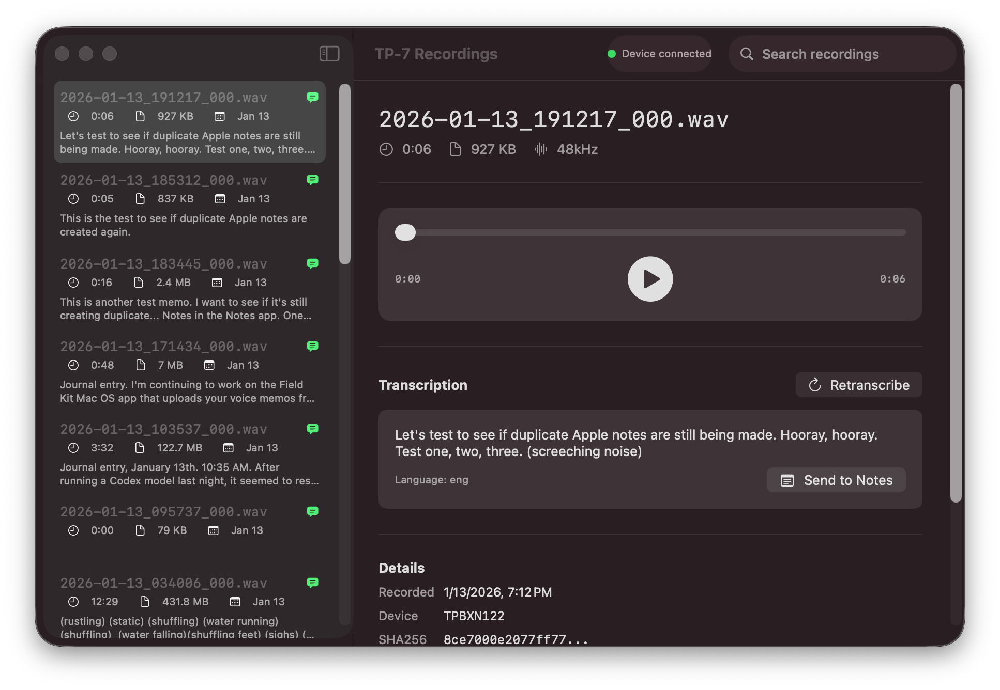
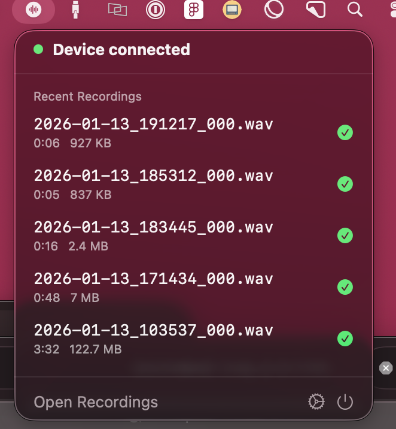
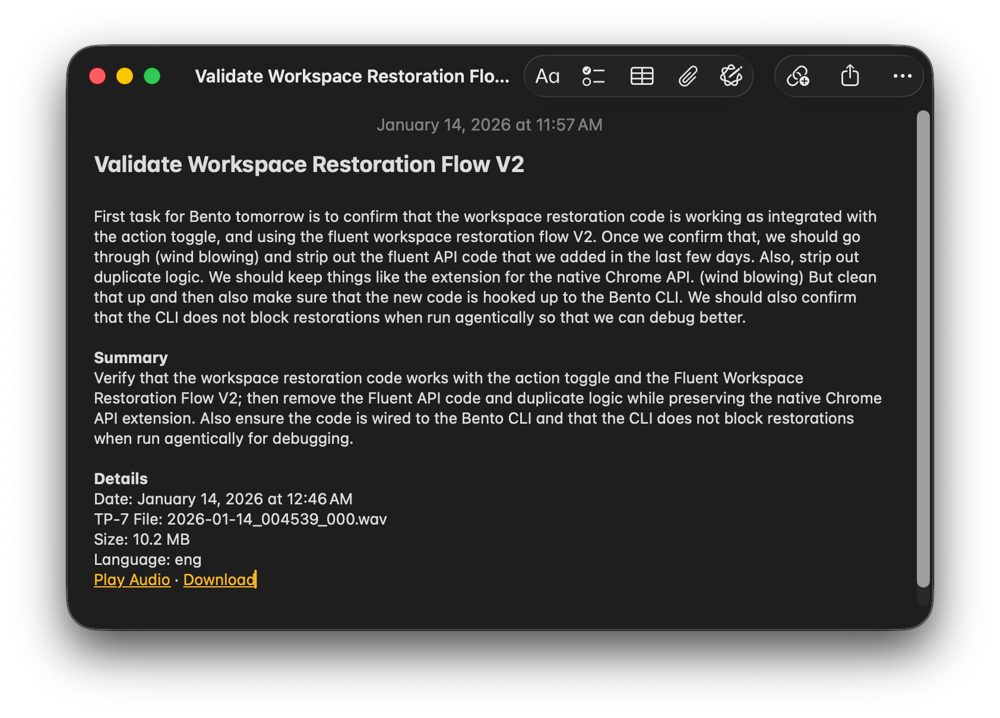
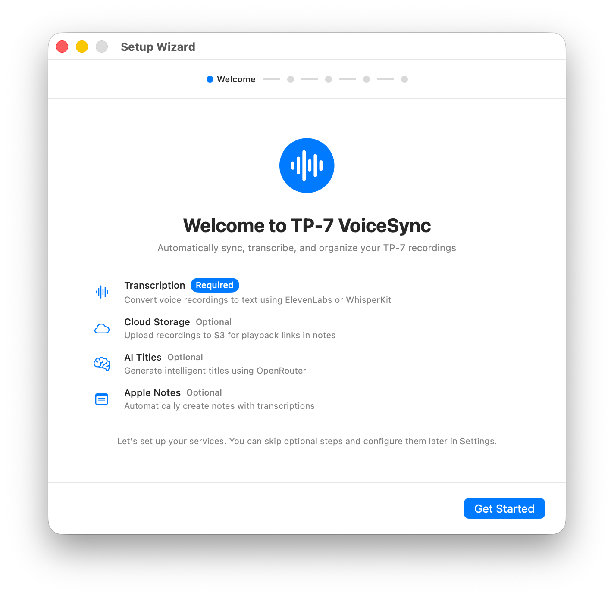
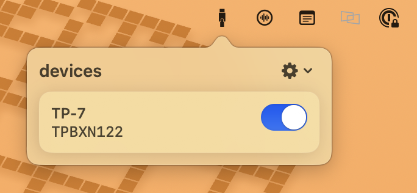

# TP-7 VoiceSync

A macOS menu bar app that automatically syncs, transcribes, and organizes your Teenage Engineering TP-7 voice recordings. Supports **fully local transcription** via [WhisperKit](https://github.com/argmaxinc/WhisperKit) — no cloud API required.

| Main Interface | Menu Bar Popover | Apple Notes Integration |
| :-----------------------------------------------------------: | :-------------------------------------: | :-------------------------------------: |
|  |  |  |
| _Recordings are automatically transcribed_ | _Menu Bar Popover_ | _Transcriptions synced to Apple Notes_ |

## Table of Contents

- [Features](#features)
- [WhisperKit Integration](#whisperkit-integration)
- [Why I Built This](#why-i-built-this)
- [About the TP-7 and FieldKit](#about-the-tp-7-and-fieldkit)
- [Requirements](#requirements)
- [Installation](#installation)
- [Setup Guide](#setup-guide)
- [Permissions & Privacy](#permissions--privacy)
- [Usage](#usage)
- [Troubleshooting](#troubleshooting)
- [Contributing](#contributing)
- [License](#license)

## Features

- **Automatic Device Detection** — Detects when your TP-7 connects via FieldKit
- **Local Transcription via WhisperKit** — Transcribe entirely on-device with no API key or internet required (after model download)
- **Cloud Transcription via ElevenLabs** — Alternative cloud-based transcription if you prefer
- **Cloud Backup to S3 (Optional)** — Upload recordings to AWS S3 with SHA256 deduplication
- **Local Storage (Optional)** — Copy recordings to a folder on your Mac when skipping S3
- **Smart Titles & Summaries** — Generates meaningful titles using LLM via OpenRouter (optional)
- **Apple Notes Integration** — Creates notes with transcriptions, metadata, and playable audio links
- **Menu Bar Interface** — Quick access to recent recordings and sync status
- **Soft Delete** — Prevents re-syncing of recordings you've deleted

## WhisperKit Integration

TP-7 VoiceSync includes [WhisperKit](https://github.com/argmaxinc/WhisperKit) by [Argmax](https://www.argmaxinc.com/) for fully local, on-device transcription. This means you can transcribe your recordings **without sending audio to any cloud service** and **without an API key**.

### How It Works

1. **Choose WhisperKit** as your transcription provider in the Setup Wizard or Settings > Transcription
2. **Select a model** from the available options (see table below)
3. **Download the model** — click "Download Model" and the app will automatically fetch the model from Hugging Face
4. **Transcribe offline** — once downloaded, transcription runs entirely on your Mac using Apple's CoreML

The model is downloaded once and cached locally. Future transcriptions use the cached model with no network required.

### Available Models

| Model | Size | Speed | Quality | Best For |
|-------|------|-------|---------|----------|
| Tiny | 75 MB | Fastest | Basic | Quick tests, low-end hardware |
| Base | 150 MB | Fast | Good | Everyday use, good balance |
| Small | 500 MB | Medium | Better | Higher accuracy needs |
| Medium | 1.5 GB | Slow | Great | When quality matters more than speed |
| Distil Large v3 | 1.5 GB | Fast | Excellent | Best speed/quality ratio |
| Large v3 | 3 GB | Slow | Best | Maximum accuracy |

### Automatic Model Download

When you select WhisperKit and click "Download Model" in the Setup Wizard or Settings, the app:

1. Downloads the selected model variant from [argmaxinc/whisperkit-coreml](https://huggingface.co/argmaxinc/whisperkit-coreml) on Hugging Face
2. Shows download progress in the UI
3. Caches the model locally for future use
4. Marks the model as ready once complete

If you switch models later, you can download the new model the same way. Each model is cached independently.

### Why WhisperKit?

- **Privacy** — Your audio never leaves your Mac
- **No API costs** — Transcribe unlimited recordings for free
- **Offline capable** — Works without internet after model download
- **Apple Silicon optimized** — Runs efficiently on M1/M2/M3 Macs via CoreML

### Future: Local LLM for Titles & Summaries

Currently, AI-generated titles and summaries require OpenRouter (a cloud LLM API). I'm planning to add support for **local LLM inference** as well, so the entire pipeline — transcription, title generation, and summarization — can run completely offline on your Mac.

This would likely use a small, efficient model optimized for Apple Silicon (similar to how WhisperKit uses CoreML). If you're interested in contributing to this or have suggestions for local LLM frameworks, feel free to open an issue.

## Why I Built This

I own a [TP-7](https://teenage.engineering/products/tp-7) and I love recording memos with it. While some may say this is a $1,400 toy for nerds masquerading as audiophiles, I find it to be an extremely pleasurable device for taking notes. Sure, I could use the Voice Memo app on my iPhone, which already has great transcription capabilities. I want to keep a device in my pocket that I can easily lose to take voice notes for ideas about side projects that I'll never complete.

The TP-7 is the Ferrari of audio recorders. It has a beautiful feel and a physical rotating recording wheel that makes me feel like I'm Don Draper leaving drunken recordings for my secretary to transcribe.

| Recording Workflow | Rewind Button Demo |
| :-----------------------------------------: | :--------------------------------------------: |
|  |  |
| _Recording a memo on the TP-7_ | _The motorized tape reel in action_ |

I love taking memos with this thing, but I didn't know what to do with these recordings. Teenage Engineering has an iPhone app and Mac app that allows you to interface with the device that is primarily designed for recording music or used with the mixer and field mic that they sell, but I really only use it for voice memos.

After futzing around for a few days, I decided to make a little macOS app that allowed me to plug it in and automatically download the voice memos. 15 hours later, I ended up with a macOS app that transcribes the audio recordings and sends them to your Notes app.

If you have a [TP-7](https://teenage.engineering/products/tp-7) and use it to record memos, then I encourage you to download and take a look.

> [!CAUTION]
> This app is 1000% vibe-coded using Claude Code while I was waiting for builds to pass. It is definitely not reviewed seriously for security concerns or major bugs that could crash your computer. Install with caution.

## About the TP-7 and FieldKit

### The TP-7 Field Recorder

The [Teenage Engineering TP-7](https://teenage.engineering/products/tp-7) is a premium portable audio recorder designed to capture sound, music, interviews, and ideas with zero friction. Key features include:

- **128GB internal storage** — enough to record 5 minutes a day for 20 years
- **24-bit/96kHz audio quality** — professional-grade recording
- **Motorized tape reel** — a beautiful, functional interface element for scrubbing and navigation
- **Built-in microphone and speaker** — record and playback anywhere
- **7-hour battery life** — all-day recording capability
- **Instant memo mode** — press the memo button when the device is off to start recording immediately

- [Teenage Engineering](https://teenage.engineering) — Official website
- [TP-7 Product Page](https://teenage.engineering/products/tp-7) — Full specs and details
- [TP-7 Guide](https://teenage.engineering/guides/tp-7) — Official user guide

### FieldKit

[FieldKit](https://teenage.engineering/guides/fieldkit) is a macOS application by Teenage Engineering that provides MTP (Media Transfer Protocol) support. This is required because macOS doesn't natively support MTP for file transfers.

When you connect your TP-7 via USB and enable MTP mode, FieldKit mounts the device storage as an accessible folder on your Mac. This app monitors that folder for new recordings.

**Get FieldKit:** [Mac App Store](https://apps.apple.com/us/app/field-kit/id1612653346)

## Requirements

- **macOS 14.0 (Sonoma)** or later
- **FieldKit** app from Mac App Store
- **Transcription** (pick one):
  - **WhisperKit** (local, free) — download a model once, then transcribe offline
  - **ElevenLabs API key** (cloud) — pay-per-use cloud transcription
- **Storage** (pick one):
  - **AWS S3 bucket** with access credentials (optional, enables playback links in notes)
  - **Local folder** on your Mac (required if you skip S3)
- **OpenRouter API key** (optional) for AI-generated titles and summaries

## Installation

1. Download the latest release from [GitHub Releases](../../releases)
2. Open the DMG file
3. Drag the app to your Applications folder
4. Launch TP-7 VoiceSync from Applications

## Setup Guide

### Setup Wizard (runs on first launch)

On first launch, TP-7 VoiceSync opens a Setup Wizard to walk you through configuration. You can also re-run it anytime via **Settings > General > Run Setup Wizard Again**.

| Setup Wizard |
| :----------: |
|  |
| _The Setup Wizard guides you through transcription, storage, and optional integrations._ |

The wizard guides you through:

- **Transcription (required)**: WhisperKit (local) or ElevenLabs (cloud)
- **Storage (choose one)**: S3 (optional) or a local folder on your Mac
- **AI Titles (optional)**: OpenRouter
- **Notes (optional)**: Apple Notes, or local Markdown files if you skip Notes

After setup, **watching/syncing TP-7 recordings is enabled by default** (you can toggle it in **Settings > General**). If you run into weird syncing behavior right after initial setup or a permissions prompt, try **quitting the app and launching it again**.

### Step 1: Install FieldKit

1. Install [FieldKit](https://apps.apple.com/us/app/field-kit/id1612653346) from the Mac App Store
2. Connect your TP-7 via USB
3. On the TP-7, enter MTP mode (shift + com, then T4)
4. Verify FieldKit shows your device is connected

### Step 2: Configure Transcription

**Option A: WhisperKit (Local — Recommended)**

1. In the Setup Wizard or **Settings > Transcription**, select "WhisperKit (Local)"
2. Choose a model (Base or Distil Large v3 recommended)
3. Click "Download Model" and wait for the download to complete
4. Enable "Enable automatic transcription"

**Option B: ElevenLabs (Cloud)**

1. Sign up at [elevenlabs.io](https://elevenlabs.io)
2. Go to your profile and copy your API key
3. In TP-7 VoiceSync, go to **Settings > API Keys**
4. Enter your ElevenLabs API key and click "Validate"

### Step 3: Configure Storage (Optional)

You can skip this step — recordings will be stored in a local folder. If you want cloud backup with playback links in notes:

1. Create an S3 bucket in the [AWS Console](https://console.aws.amazon.com/s3)
2. Create an IAM user with S3 access (recommended policy: `AmazonS3FullAccess` or a custom policy for your bucket)
3. Generate an Access Key ID and Secret Access Key for the IAM user
4. In TP-7 VoiceSync, go to **Settings > Storage** and enter your bucket name, region, and prefix
5. Go to **Settings > API Keys** and enter your AWS Access Key ID and Secret Access Key
6. Back in **Settings > Storage**, click "Test Connection" to verify

### Step 4: Set Up OpenRouter (Optional)

OpenRouter provides LLM access for generating intelligent titles and summaries.

1. Sign up at [openrouter.ai](https://openrouter.ai)
2. Get your API key from the dashboard
3. In TP-7 VoiceSync, go to **Settings > API Keys**
4. Enter your OpenRouter API key
5. Go to **Settings > Transcription** and select your preferred model

### Step 5: Configure Apple Notes (Optional)

1. In TP-7 VoiceSync, go to **Settings > Transcription**
2. Enable "Send to Apple Notes"
3. Set your preferred folder name (default: "TP-7 Transcripts")
4. Choose the link expiry duration for audio playback links

## Permissions & Privacy

TP-7 VoiceSync runs locally by default, and only uses network services if you enable them (S3, ElevenLabs, OpenRouter). Credentials are stored in your Mac's Keychain.

When you first use the app, you may see the following permission prompts:

### FieldKit Container Access

To watch for new recordings, the app reads the FieldKit container folder where the TP-7 MTP mount appears. macOS may prompt you to allow access to FieldKit's data.

### Keychain Storage

API keys and cloud credentials are stored securely in the macOS Keychain (not in plaintext files).

### Local vs Cloud Processing

- **WhisperKit (Local)**: transcription runs on-device after you download a model. No audio is sent anywhere.
- **ElevenLabs / OpenRouter / S3**: audio and/or text is sent to those services when enabled.

### Apple Notes Automation

The app uses AppleScript to create notes in Apple Notes. macOS will ask for permission to allow the app to control Notes. Click "OK" to grant this permission.

### Notifications

The app can notify you when your TP-7 connects and when recordings are synced. You can enable or disable these in **Settings > General**.

### Network Access

The app needs network access to upload to S3 and communicate with the ElevenLabs and OpenRouter APIs. This is handled automatically by macOS. If you use WhisperKit with local storage, no network access is required after the initial model download.

## Usage

1. **Connect your TP-7** via USB with FieldKit running
2. **Turn on the connection** in the FieldKit menu bar app.

| FieldKit Connection |
| :-----------------: |
|  |

3. **New recordings automatically sync** — the app detects new WAV files and processes them (watching is enabled by default)
4. **View recent recordings** in the menu bar popover
5. **Access all recordings** via "Open Recordings" in the menu
6. **Find transcriptions** in Apple Notes in your configured folder

Each note includes:

- Full transcription text
- AI-generated title and summary (if enabled)
- Recording metadata (date, filename, duration, file size, language)
- Play and download links for the audio

## Troubleshooting

### Device Not Detected

- Ensure FieldKit is running
- Check that your TP-7 is in MTP mode (shift + com, then T4)
- Try disconnecting and reconnecting the USB cable
- Check **Settings > General** to ensure device watching is enabled (it's on by default)
- If you just installed the app or just granted a permission prompt, try **quitting the app and launching it again**

### Upload Fails

- Verify your S3 bucket settings in **Settings > Storage**
- Verify your AWS credentials in **Settings > API Keys**
- Check that your IAM user has permission to write to the bucket
- Ensure you have internet connectivity
- Try the "Test Connection" button in Storage settings

### Transcription Fails

- **WhisperKit**: Make sure the model is downloaded (check Settings > Transcription for status)
- **ElevenLabs**: Verify your API key in **Settings > API Keys** and check your account balance
- Ensure the recording uploaded successfully to S3 first (if using ElevenLabs)

### WhisperKit Model Won't Download

- Check your internet connection
- Ensure you have enough disk space (models range from 75 MB to 3 GB)
- Try a smaller model first (Tiny or Base)
- Check Console.app for detailed error messages

### Notes Not Appearing

- Check that Apple Notes integration is enabled in **Settings > Transcription**
- Verify the app has permission to control Notes (System Settings > Privacy & Security > Automation)
- Make sure the Notes app is installed and signed in

## Contributing

If you're interested in contributing, you're more than welcome. Bug fixes, small UX improvements, and documentation PRs are all appreciated.

- Open an issue (or just a PR) with a clear description of the change
- Build/run locally with Xcode: `open TeenageEngVoiceSync.xcodeproj`
- Or build from the CLI: `xcodebuild -project TeenageEngVoiceSync.xcodeproj -scheme TeenageEngVoiceSync -configuration Debug build`

Please avoid committing secrets — API keys are stored in Keychain.

## License

MIT License — see LICENSE file for details.
